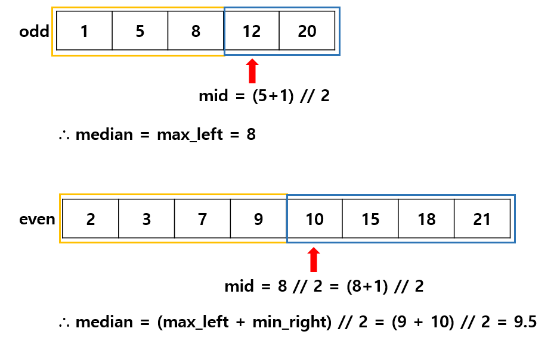

# Median of Two Sorted Arrays

### Key Point


Binary Search without Merge = Divide each array into left and right parts appropriately.

<br>

### Algorithm Approach

1. **Determine paritions Each Array**

   - `mid1`  
     It means that the **number of elems** on the left side of `nums1`  
     (Note: its index indicates the position of min_right in the right partition)

   ```python
       mid1 = (low + high) // 2
   ```

   - `mid2`  
     It means that the **number of elems** on the left side of `nums2`

   ```python
       mid1 + mid2 = (total_len+1) // 2
       mid2 = (total_len+1) // 2 - mid1
   ```

<br>

2. **Check if partition is correct**

```python
nums1 = [ ... max_left1 | min_right1 ... ]
nums2 = [ ... max_left2 | min_right2 ... ]
```

Since two input arrays are sorted, the following conditions hold!

```python
max_left1 <= min_right1
max_left2 <= min_right2
```

Therefore, we only compare across the arrays!

```
if max_left1 <= min_right2 and max_left2 <= min_right1:
```

<br>

- If correct paritions...
  - even
    ```python
    return (max(max_left1, max_left2) + min(min_right1, min_right2)) / 2
    ```
  - odd
    ```python
    return max(max_left1, max_left2)
    ```
- If Not, move Binary search range

```python
    elif max_left1 > min_right2:
        right = part1 - 1
    else:
        left = part1 + 1
```

<br>

### Why +1?

  
Make the left partition 1 element larger to ensure the median is included in the left partition **even if total_len is odd**.
