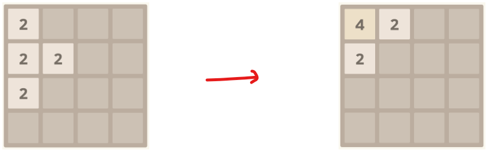
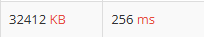
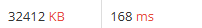

# 2048 (Easy)

## 문제

- **2048 게임**
  - 한 번의 이동 = 상하좌우 네 방향 중 하나로 이동
  - 같은 값의 두 블록이 충돌하면 하나로 합쳐짐
  - 똑같은 수가 세 개가 있는 경우에는 이동하려고 하는 쪽의 칸이 먼저 합쳐진다
    

- **Input**
  - `N` = 게임판의 크기 N (1 <= N <= 20)
  - 게임판의 초기 상태 (0 or 2의 제곱)

- **Output**
  - N x N의
  - 최대 5번 상,하,좌,우 이동시켜서 얻을 수 있는 가장 큰 블록

<br>
<br>

## Key point

- **Brute Force**
  - 4^5 = 2^10의 경우의 수
    - 한 move 당 4가지(상하좌우) \* 5번

<br>

- **Q. 방향마다 구현이 다른데, 특히 열 방향(위/아래)은 어떻게 구현할까?**  
  A. 방향마다 구현하는 것보다, 왼쪽 이동만 구현하고 다른 방향은 회전(or 전치)시켜 방향을 통일하는 것이 더 빠를 것이다.  
  ex.
  ```
    # 위쪽 이동 -> # transpose -> # 왼쪽 이동 -> # 복구(transpose)
      1 0 2         1 0 3          1 3 0        1 1 2
      0 1 0         0 1 0          1 0 0        3 0 1
      3 0 1         2 0 1          2 1 0        0 0 0
  ```

<br>

- **Q. Block 이동은 어떻게 해야 할까?**  
  A. 각 행에서 숫자값만 모은 뒤, 필요한 수만큼 0으로 채우면 된다.  
  ex. `[2, 0, 0, 4] -> [2, 4] + [0, 0]`

<br>
<br>

## Algorithm Approach

1. `transpose`

```python
    def transpose(temp_board): # column -> row
        new_board = [[0]*N for _ in range(N)]
        for i in range(N):
            for j in range(N):
                new_board[j][i] = temp_board[i][j]

        return new_board
```

열을 행으로 transepose 시킨다. 즉 좌표를 보았을 때 (i, j) -> (j, i)로 바꾸는게 포인트

<br>

2. **왼쪽으로 이동**

```python
    def move(temp_board): # move left
        new_board = []
        for row in temp_board:
            row = [x for x in row if x != 0]
            merged_row = [] # 숫자값만 따로 수집
            idx = 0

            while idx < len(row): # 같은 숫자 합치기 + 합친 숫자는 다시 합치지 않음
                if idx+1 < len(row) and row[idx] == row[idx+1]: # 합칠 수 있다면
                    merged_row.append(row[idx]*2)
                    idx += 2
                else: # 나머지
                    merged_row.append(row[idx])
                    idx += 1

            merged_row += [0] * (N - len(merged_row)) # 남은 길이만큼 0 추가
            new_board.append(merged_row)

        return new_board
```

<br>

3. **brute force**

아래 코드는 재귀를 활용한 DFS라고 생각하면 된다.

```python
    def dfs(cnt, board):
        if cnt == 5: # base case
            return max(board[i][j] for i in range(N) for j in range(N))

        result = 0
        prev = [row[:] for row in board] # 현재 cnt의 원본 board
        for x, y in zip(dx, dy):
            if x == -1: # 위로
                # transpose
                temp = transpose(prev)
                # move
                temp_board = move(temp)
                # 복구
                temp_board = transpose(temp_board)
            elif x == 1: # 아래로
                # transpose
                temp = transpose(prev)
                # reverse
                temp = [row[::-1] for row in temp]
                # move
                temp_board = move(temp)
                # 복구
                temp_board = [row[::-1] for row in temp_board]
                temp_board = transpose(temp_board)
            elif y == 1: # 오른쪽
                # reverse
                temp = [row[::-1] for row in prev]
                # move
                temp_board = move(temp)
                # 복구
                temp_board = [row[::-1] for row in temp_board]
            else: # 왼쪽
                # move
                temp_board = move(prev)

            result = max(result, dfs(cnt+1, temp_board)) # 탐색

        return result # 재귀 return
```

<br>
<br>

### 추가

1. **Backtracking**  
   위의 코드에서는 모든 경우를 끝까지 탐색하기 때문에 backtracking은 아니다. backtracking이 되려면 중간에 탐색을 중단(가지치기, pruning)해야 한다. 아래는 pruning을 추가한 코드이다.

```python
    def backtrack(cnt, board, current_max):
        if cnt == 5:
            return current_max

        prev = [row[:] for row in board]
        result = current_max

        for x, y in zip(dx, dy):
            # 이동

            # 현재 최댓값을 남은 (5-cnt)번 동안 매번 2배씩 합쳐도
            # 이미 찾은 result를 넘을 수 없으면 pruning
            board_max = max(temp_board[i][j] for i in range(N) for j in range(N))
            if board_max * (2 ** (5 - cnt)) <= result:
                continue

            # 탐색
            result = max(result, backtrack(cnt+1, temp_board, board_max))

        return result
```

<br>

2. **rotate**  
   roate 방식은 `main2.py`를 참고하길 바란다. 시계방향으로 90도 회전하는 방식으로 방향 회전을 구현할 수 있다.

```python
def rotate(board, N):
    new_board = [[0]*N for _ in range(N)]
    for i in range(N):
        for j in range(N):
            new_board[j][N-1-i] = board[i][j]
    return new_board
```

<br>

```python
def move(board, N, direction):
    for _ in range(direction): # rotate
        board = rotate_90(board, N)
    board = move_left(board, N) # move
    for _ in range(4 - direction): # 복구
        board = rotate_90(board, N)
    return board
```

rotate 방식은 방향에 상관없이 항상 4번(회전 + 역회전) 연산하지만,
transpose + reverse 조합은 방향마다 연산 횟수가 다르다.  


평균적으로 transpose + reverse 조합이 연산 횟수가 적어 더 효율적이다.  

