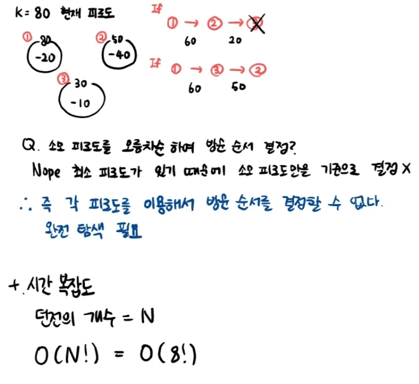
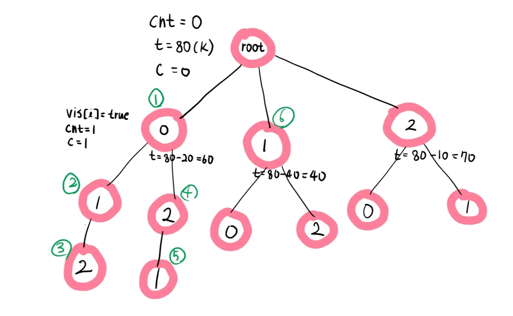

## 문제

- Input  
  k = 현재 피로도 (1~5,000)  
  dungeons = 각 던전별 "최소 필요 피로도", "소모 피로도"가 담긴 2차원 배열
  - n = 던전 개수 (1~8) - m = ["최소 필요 피로도", "소모 피로도"] 모두 1이상 1,000 이하  
    최소 필요 피로도는 소모 피로도보다 크거나 같다.
- Output  
  유저가 탐험할 수 있는 최대 던전 수  
  각 던전마다 -> 탐험 시작 전 필요한 최소 필요 피로도를 맞추기, 탐험 후 소모 피로도 만큼 소모

 

## Key point

- 던전의 방문 순서에 따라 방문할 수 있는 던전의 개수가 다르다!!
  

 
 
1. 모든 경우의 수에 대해서 확인 후 정답 확인 == Brute Force
2. 최소 피로도를 체크하면서 방문 가능한 경우에 대해서만 재귀 == Backtracking
   
