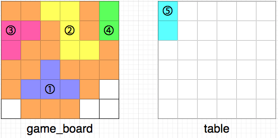
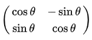
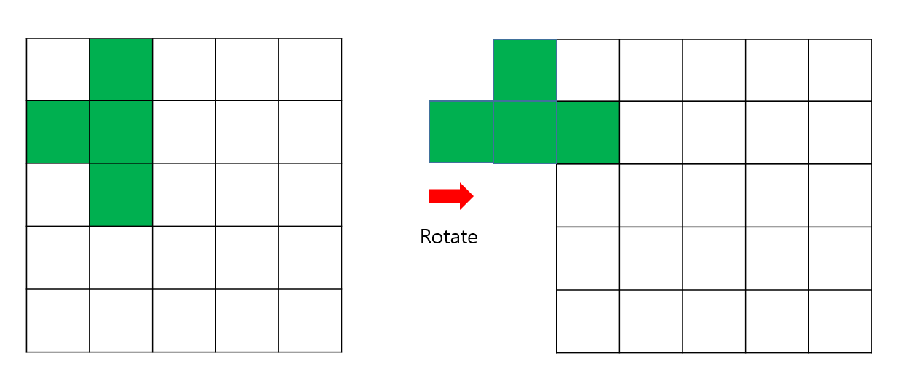

# 퍼즐 조각 채우기

## 문제

- **Input**  
  `game_board` = 현재 게임 보드의 상태 (3 <= N <= 50)  
  `table` = 테이블 위에 놓인 퍼즐 조각 상태 (game_board의 행의 길이와 같음)

- **Output**  
  규칙에 맞게 최대한 많은 퍼즐 조각을 게임 보드에 채워 넣을 때 총 몇 칸을 채울 수 있는가?
  - 규칙
  - 1: 조각은 한 번에 하나씩
  - 2: 조각을 회전시킬 수 있음
  - 3: 조각을 뒤집을 수 없다
  - 4: 게임 보드에 새로 채워 넣은 퍼즐 조각과 인접한 칸이 비어 있으면 X

  
| 정답 예시

<br>

## Algorithm Approach

규칙4에 따르면 무조건 게임보드의 빈 칸과 퍼즐 조각이 **완전히 일치하는 경우**에 놓아야 한다. 전체적인 알고리즘은 다음과 같다.

1. BFS로 `game_board`의 모든 빈칸 모양의 좌표 탐색
2. BFS로 `table`의 퍼즐 조각 모양의 좌표 탐색
3. 1과 2에서 수집한 퍼즐 모양이 일치하는 경우를 모두 찾기

<br>

다음과 같은 이유로 3번이 가장 헷갈릴 것이다.

- 1, 2에서 수집한 퍼즐의 좌표가 각각 다르다.
- 회전을 어떻게 구현할까..?

<br>

### 1. 퍼즐의 좌표가 다르다

  
퍼즐의 절대 좌표가 모두 다르기 때문에 모든 퍼즐을 (0,0)부터 시작하는 동일한 좌표계로 변환해야 한다.  
즉, 각 퍼즐의 최소 좌표 `(minX, minY)`가 원점 `(0,0)`이 되도록 각 퍼즐 조각의 좌표를 평행이동 시켜준다.

```python
    minX = min(x for x, y in puzzle)
    minY = min(y for x, y in puzzle)
    [(x-minX, y-minY) for x, y in puzzle]
```

이제 퍼즐 모양이 같은지만 판단하면 된다.

<br>

### 2. Rotate 구현

  
Rotation matrix를 기억해보자.

점 P(x, y)를 원점 중심으로 θ만큼 회전한 점 P'(x', y')는 다음과 같이 구할 수 있다.
$$x' = x\cos\theta - y\sin\theta$$
$$y' = x\sin\theta + y\cos\theta$$

이때
$$\cos(-90°) = 0, \quad \sin(-90°) = -1$$
이므로

즉, `(x, y) → (y, -x)`로 바꿔주면 된다!

<br>

만약 코테를 풀다가 이 matrix가 기억이 안 난다면.. 간단한 예시를 생각해보자!

```
점 (1, 0) -> 시계방향으로 90도 회전 -> (0, -1) -> 시계 방향으로 90도 회전 -> (-1, 0)
```

패턴을 찾으면 `(x, y) -> (y, -x)`임을 알 수 있다.

<br>


위와 같이 퍼즐에 회전 변환을 적용하면 최소 좌표가 변한다. 따라서 매 rotate마다 `(0,0)`이 기준이 되도록 translate 해줘야 함을 알 수 있다.

```python
    def rotate(puzzle):
        rotate_puzzle = [(y, -x) for x, y in puzzle]
        return translate(rotate_puzzle)
```

<br>

### 주의

퍼즐 좌표를 수집할 때 같은 모양의 퍼즐이어도 회전 정도가 다르다면 수집된 각 좌표 조각의 순서에 차이가 발생한다.
Python에서 **list 비교 `==`는 내용뿐만 아니라 순서까지 일치해야 True를 반환**하므로, 두 리스트를 `sorted()`로 정렬한 후 비교해야 한다.

참고로 `c++`에서는 `std:vector` 역시 `==` 연산자도 vector의 크기, 값을 모두 비교한다고 하니! 같은 logic을 작성하면 된다!

- tuple -> `std::pair`
- `sorted` -> `std::sort`를 사용하면 됨.
