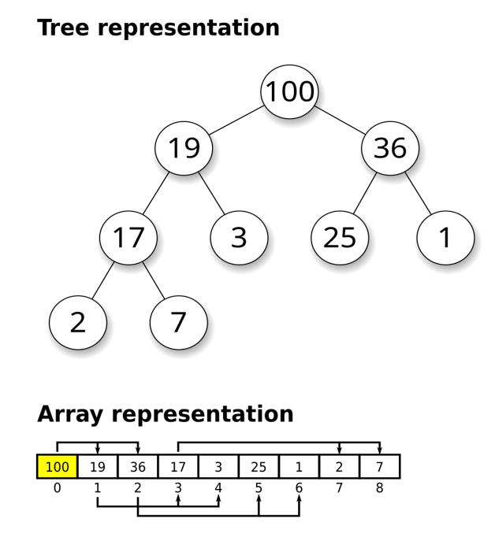

# 이중우선순위큐

## 문제

- **이중 우선순위 큐란?**  
  우선 순위 큐에서 최댓값과 최솟값을 삭제할 수 있는 연산을 할 수 있는 자료구조

- **Input**
  - operations = 이중 우선순위 큐가 할 연산 = 길이가 (1, 1,000,000) 인 문자열 배열
  - 연산
    - I 숫자 = 큐에 주어진 숫자 삽입
    - D 1 = 큐에서 최댓값 삭제
    - D -1 = 큐에서 최솟값 삭제
- **Output**
  - 모든 연산 처리 후 큐가 비어있으면 [0,0] 않으면 [최댓값, 최솟값]

<br>

## Key point

Max Heap과 Min Heap을 사용.
이때 동기화에 필요한 count 배열이 필요하다.

물론 Max Heap과 Min Heap 모두 정렬이 안 되어있다! count로 유효성을 체크하고(즉 없는 숫자인가), top에 올라올 때 걸러내는 **lazy deletion** 방식!!

```python
I 3, I 1, I 5, D 1 (최댓값 삭제) 입력 시

max_heap: [5, 3, 1]  → top=5 삭제 → count[5]=0
min_heap: [1, 3, 5]  → top은 1, 근데 5가 삭제된 거 어떻게 앎?

→ 나중에 min_heap에서 5가 top으로 올라올 때
  count[5]==0 이면 그냥 버림!
```

<br>

### 🤔 Heap

> 

- Max 값과 Min 값을 찾아내기 위해 고안된 **Complete Binary Tree**
- 트리 계층 구조를 가지지만 내부적으로 **Array**와 Index 계산만으로 부모/자식을 찾는다
  - Index 규칙 (Complete Binary)
    1.  parent: (i-1) / 2
    2.  left child: 2\*i + 1
    3.  right child: 2\*1 + 2

- 종류
  - **Max Heap**: 부모 노드의 값이 자식 노드의 값보다 크거나 같은 경우.
  - **Min Heap**: 부모 노드의 값이 자식 노드의 값보다 작거나 같은 경우.

하지만 같은 level의 노드끼리의 대소관계는 중요하지 않다. 오직 부모만!!

<br>

### Method

- **Insert (Shift UP)**

```bash
[1, 3, 2, 5, 4] 에 0 추가

1. 맨 끝에 붙임
   [1, 3, 2, 5, 4, 0]

2. 부모(2)랑 비교 → 0이 더 작으니까 스왑 (최소힙 기준)
   [1, 3, 0, 5, 4, 2]

3. 부모(1)랑 또 비교 → 0이 더 작으니까 스왑
   [0, 3, 1, 5, 4, 2]

4. 루트 도달 → 끝!
```

<br>

- **Delete (Shift Down)**

```bash
[0, 3, 1, 5, 4, 2] 에서 루트 제거

1. 루트(0) 제거, 맨 끝(2)을 루트로 올림
   [2, 3, 1, 5, 4]

2. 자식들(3, 1)이랑 비교 → 1이 더 작으니까 스왑
   [1, 3, 2, 5, 4]

3. 자식들(없음) → 끝!
```

<br>

### 언제 쓸까?

- 매번 최대/최소를 알아야 할 때
- 다익스트라 (항상 가장 가까운 노드)
- 작업 스케쥴링 (우선순위 높은 것 먼저)

왜냐하면 min_Heap, max_Heap 모두 전체 원소의 최대, 최소(Root)만 보장된다. 나머지 순서는 보장 안 된다. 전체 정렬를 위해서는 `sort` 를 해야 한다.

✅ **최댓값/최솟값을 꺼낼 때 (`top()`) O(1)을 보장!!**

<br>
<br>

**✅ 시간 복잡도**  
insert, delete 모두 트리의 최대 높이만큼 비교 = **O(log N)**

<br>
<br>

## Algorithm Approach

최대값 삭제인 경우 `maxHeap`에서 pop  
최솟값 삭제인 경우 `minHeap`에서 pop

이때 `count`: 숫자의 횟수를 저장하는 dict를 활용하여 동기화.

1. **삭제 전 동기화**

`maxHeap` 혹은 `minHeap`에서 이미 삭제된 원소일 수 있으므로 `count`로 확인해준다.

```python
  while maxHeap and count[-maxHeap[0]] == 0:
    heapq.heappop(maxHeap)
```

<br>

2. **빈 heap 체크 후 삭제**

```python
  if maxHeap:
      count[-maxHeap[0]] -= 1
      heapq.heappop(maxHeap)
```
