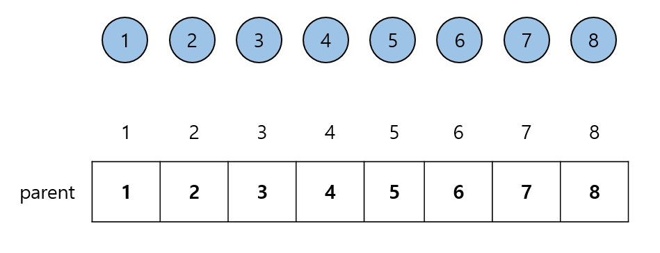
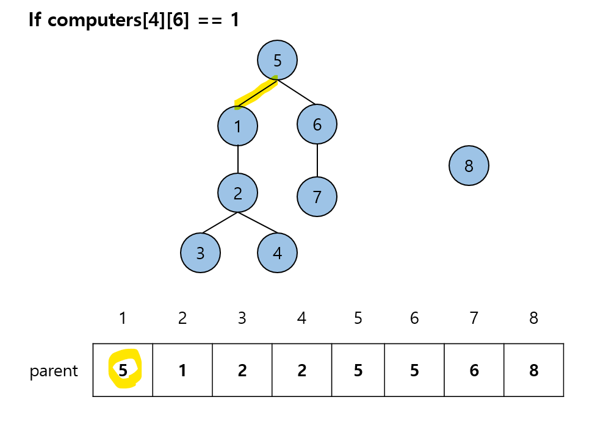

# 네트워크

## 문제

- **Input**

  - n: 컴퓨터 개수 (1 이상 200 이하)
  - computers: 연결에 대한 정보가 담긴 2차원 배열 (0부터 n-1인 정수)
    - i번 - j번 컴퓨터 연결: computers[i][j] = 1, 즉 양방향임을 알 수 있음

- **Output**  
  네트워크의 개수

<br>
<br>

## Key point

**1. 네트워크 정의**  
A - B → B - C → C - A  
= A,B,C는 모두 같은 네트워크!

<br>

**2. Union Find (Disjoint Set Union)**

- 여러 개의 분리된 집합들을 효율적으로 관리하기 위한 자료 구조
- 두 노드가 같은 집합에 포함되는지 여부를 파악해야 할 때 사용 = **together or not?**
- **Operations**
  - `find(x)`: Returns the representative element of x’s circle == **which circle is "x" in?**
  - `union(a, b)`: Merges the circles that contain a and b == **Can we merge a and b into one circle?**

<br>
<br>
 
## Algorithm Approach
### 0. Init

```python
  parent = list(range(n))
```



모든 노드가 자기 자신이 root인 상태

<br>

### 1. find

```python
  def find(x):
        if parent[x] != x:
            parent[x] = find(parent[x])  # Path Compression

        return parent[x]

```


여기서 핵심은 **Path Compression**  
모든 노드의 부모를 직접 root로 바꿔준다. (path compression 없이 find를 재귀호출 하여 root를 찾아도 상관없다다.)

<br>

### 2. union

```python
  a_root = find(a)
  b_root = find(b)
```


Merge 하려는 각 노드가 속한 집합의 root를 각각 찾는다.  
위의 그래프에서 4번 노드가 속한 집합의 root는 1번  
6번 노드가 속한 집합의 root는 5번이다.

<br>

```python
  if a_root != b_root:  # a_root의 부모를 b_root로 바꾸기
            parent[a_root] = b_root
```



한 root를 다른 root의 자식으로 만들면 두 집합을 같은 집합으로 합쳐진다.  
즉 root 1의 부모를 1 -> 5

<br>
<br>

## 궁금한 점..

Q. 그냥 각 네트워크의 노드를 set 자료구조에 저장하면서 찾으면 안 되나?

A. Claude 답

- 시간복잡도 증가: set 합치기가 O(n)  
  Union Find는 거의 O(1)에 가까움
- 메모리 낭비: 각 set이 네트워크의 모든 원소를 저장  
  Union Find는 부모 정보만 저장 (O(n))

<br>
<br>

## 참고자료

[What to Know About the Union Find Algorithm](https://algodaily.com/lessons/what-to-know-about-the-union-find-algorithm)
