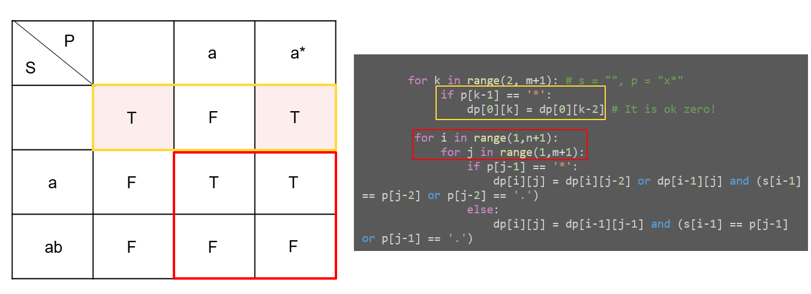

# Regular Expression Matching

## Problem

- **Input**
  - `s` = input string (1~20, only lowercase letters)
  - `p` = pattern (1~20)
    - `'.'` : Matches any single character
    - `'*'` : Matches zero or more of the preceding element

- **Output**
  - The matching should cover the entire input string (not partial)!
  - Note) Guarantee that x is valid character in 'x\*'

<br>
<br>

## Key point

- `dp[i][j]` = `s[:i]`가 `p[:j]`에 완전히 매칭되는지 여부 (bool)
  - index 0은 빈 문자열("")을 의미 → `dp[i][j]`에서 실제 문자는 `s[i-1]`, `p[j-1]`
  - `dp[0][0] = True` : 빈 문자열은 빈 패턴과 매칭
  - `dp[n][m]` 이 최종 답

<br>

- Q. Why DP?
- A. 현재 매칭 결과가 **이전 부분 문제(subproblem)에 의존** (Overlapping Subproblems + Optimal Substructure)
  - `*`를 0번 쓸지, 1번 이상 쓸지에 따라 경우가 나뉘고, 두 경우 모두 이미 계산한 dp 값을 재사용
  - Brute force로 풀면 각 `*`마다 재귀 분기가 폭발적으로 늘어남 → DP로 O(nm)으로 해결

<br>

- Base case: `s = ""` 일 때 `p`가 매칭 가능한 경우
  - `p = "a*"`, `"a*b*"` 처럼 `char*` 쌍을 0번 반복하면 빈 문자열과 매칭 가능
  - `p[k-1] == '*'` 이면 `dp[0][k] = dp[0][k-2]`

<br>
<br>

## Algorithm Approach



1. DP 테이블 `dp[n+1][m+1]` 초기화 (모두 `False`)

<br>

2. Base case 설정

```python
dp[0][0] = True

for k in range(2, m+1):   # s = "", p = "x*" or "x*y*" ...
    if p[k-1] == '*':
        dp[0][k] = dp[0][k-2]  # x* → 0번 사용 → x* 쌍을 제거한 것과 같음
```

<br>

3. `i = 1..n`, `j = 1..m` 에 대해서 dp 채우기

   **Case 1) `p[j-1] == '*'`** (`p[j-2](char)` + `*` 쌍)

```python
dp[i][j] = dp[i][j-2] or (dp[i-1][j] and (s[i-1] == p[j-2] or p[j-2] == '.'))
```

| 경우              | 식                           | 의미                                                                      |
| ----------------- | ---------------------------- | ------------------------------------------------------------------------- |
| `*` 0번 사용      | `dp[i][j-2]`                 | `p[j-2]*` 쌍 자체를 제거, `s[:i]`와 `p[:j-2]` 매칭                        |
| `*` 1번 이상 사용 | `dp[i-1][j] and (문자 일치)` | 직전까지 매칭(`dp[i-1][j]`)과 `p[j-2]`를 현재 `s[i-1]`에 사용했을 때 일치 |

> **🤔 왜 `dp[i-1][j-2]`가 아니라 `dp[i-1][j]`인가?**  
> 현재 `s[:i]`에 대해서 `*`가 1번 이상 사용되는 경우를 Matching 하기 위해서는, 이전 `s[:i-1]`에 대해서 `*`가 0번 이상 사용된 경우를 포함해야 한다.
> 어떤 패턴까지 matching을 확인해야 할까?
>
> - `dp[i-1][j]` → `p[:j]` (char* 쌍 **포함**) 과 비교 → char*가 0번, 1번, 2번 ... 쓰이는 경우 모두 커버 → 현재에 대해서 **총 1번 이상** 매칭 경우를 확인 할 수 있음.
> - `dp[i-1][j-2]` → `p[:j-2]` (char* 쌍 **제외**) 과 비교 → char*가 아예 안 쓰인 경우 → 현재에 대해서 **총 1번** 매칭 경우만을 확인하는 셈, 즉 char가 2번 이상 반복되는 경우에 대해서 mathing 불가

  <br>

**Case 2) `p[j-1] != '*'`** (일반 문자 또는 `'.'`)

```python
dp[i][j] = dp[i-1][j-1] and (s[i-1] == p[j-1] or p[j-1] == '.')
```

- 직전까지 매칭(`dp[i-1][j-1]`)이 성립하고, 현재 문자끼리 일치해야 함

<br>
