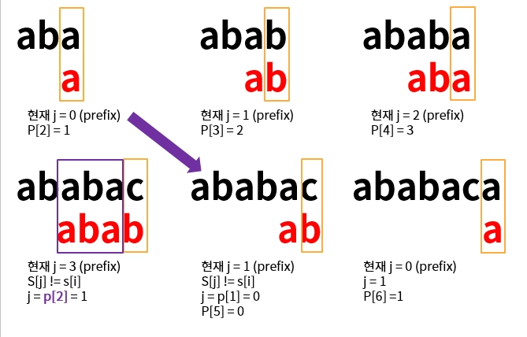

# 찾기

## 문제

- **Input**
  - `T` = 텍스트 문자열 (1 <= n <= 100만)
    - n >= m
  - `P` = 패턴 문자열 (1 <= m <= 100만)
  - 알파벳 대소문자와 공백으로만 이루어짐

- **Output**
  - T 중간에 P가 몇 번 나타나는지를 나타내는 음이 아닌 정수를 출력
  - P가 나타나는 위치를 차례대로 공백으로 구분해 출력
    - EX) T[i:i+m-1] == P[1:M] 이면 i

<br>
<br>

## Key point

- 단순한 방법
  - T의 1번~N번을 시작점으로 매 P의 1번~M번을 비교
  - 시간복잡도는 `O(NM)`

- **KMP (Knuth-Morris-Pratt)**
  - 대표적인 문자열 매칭 알고리즘
  - 시간복잡도는 `O(N) + O(M)`
  - _🤔 현재까지 Matching된 정보를 활용할 수 없을까?_
    - Matching해서 알 수 있는 정보

      ```
              1 2 3 4 5 6 7 8 9 …
        T : [ A B C D A B C D A B D E ]
              | | | | | | X
        P : [ A B C D A B D ]
              1 2 3 4 5 6 7
      ```

      T의 1번부터 P를 Matching 해보자. 이때 여기서는 T[7] != P[7]라는 정보 그리고 T[1:6] = P[1:6]라는 정보를 알 수 있다.

    - Matching된 P 내부에 존재하는 prefix == suffix 활용

      ```
              1 2 3 4 5 6 7 8 9 …
        T : [ A B C D A B C D A B D E ]
                      | | | | | | |
        P :         [ A B C D A B D ]
                      1 2 3 4 5 6 7
      ```

      T[1:6] = P[1:6]임을 알고 있고, P[1:6] 내에서 P[1:2] = P[5:6] = `AB`이다.
      따라서 P[3]과 T[7] 문자부터 비교하면 된다.

  - 처음부터 T와 P를 하나씩 비교하는 게 아니라, 매칭 실패 시 *prefix이면서 suffix인 border*를 따라가며 다음 비교 위치를 찾는다.

<br>

✅ 정리

1. j=1~m일 때, P[1:j]에 대해 P[1:k] = P[j-k:j-1]을 만족하는 최대의 `k`를 미리 계산하여 저장 → `O(M)`
2. T의 i번 문자에서 Matching 시작 → `O(N)`
3. 만약 T[i+j-1] != P[j]라면 P[1:j-1]까지는 Matching 완료
4. 이때 P[1:k] = P[j-k:j-1]를 만족하는 최대 border(k)만큼 P를 이동
5. T[i+j-1]와 P[k+1] 부터 비교

<br>
<br>

## Algorithm Approach

1. **Failure table**

- `fail[j-1]` = s[j]에서 matching 실패시 s의 1번째 ~ j-1번째의 부분 문자열에서 prefix == suffix일 때의 최대 길이.
- 즉 s를 오른쪽으로 밀어낼 border 위치. 즉 s[i]에 위치시킬 prefix의 다음 index가 나온다.
- table에는 prefix == suffix가 보장된 위치만 저장할 수 있다는 점을 다시 한번 기억하자!

```python
  n = len(s)
  fail = [0] * n # 현재까지 matchig된 index
  j = 0 # 현재 matching을 시도할 위치이자 border

  for i in range(1, n): # 현재까지의 부분 문자열
      while j > 0 and s[i] != s[j]: # s[i]와 s[j]가 matching되는 border를 찾을 때까지 (j=0이면 x)
          j = fail[j - 1]
          # s[1:j-1]일 때 suffix와 같은 prefix의 다음 index

      # 현재 index를 비교
      if s[i] == s[j]: # 현재까지 border에서 한글자 더 이어질 수 있다면
          j += 1
          fail[i] = j
```

핵심은 matching 실패 시 가능한 border 후보들을 줄여가며, 현재 border에서 P[j]가 이어질 수 있는지 확인한다.

<br>

그림을 통해 알아보자.



s = ABABACA일 때 fail table을 만들어보자!

1-1. 현재 border는 아무것도 없고(j=0), aba(i=2)라는 문자열에서 border를 찾는다.
이때 s[i] = s[j] 이므로 fail[2] = 1 = j+1이다. 즉, `aba`일 때 border의 다음 index는 1이다.

2-1. 현재 border가 aba(j=3)이고 ababac(i=5)라는 문자열에서 border를 찾는다. 이때 s[i] != s[j] (c != b) 이다.

→ 이때 border를 줄여서 j=2(aba)일 때 border를 찾는다. 이는 fail[2]이다.

→ prefix 중 suffix가 되는 것들(border)만 따라가야 함 ( 테이블에는 prefix == suffix가 보장된 위치만 저장할 수 있으니)

<br>

1. **Matching**

fail P를 이동시키면서 matching을 찾아보자! 이때 T는 하나씩 증가시키고 P를 옮기는 방식이다!

```python
  idx_P = 0 # index for P
  count = 0
  answer = []
  for idx_T in range(N): # start index for T
      while idx_P > 0 and T[idx_T] != P[idx_P]: # 같지 않다면
        idx_P = fail[idx_P-1]

      # 같다면
      if T[idx_T] == P[idx_P]:
        idx_P += 1

      if idx_P == M:
        count += 1
        answer.append(idx_T-M+2) # 문제 요구사항 1-index
        idx_P = fail[idx_P-1]

```
